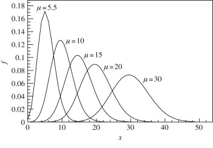

```{r setup, include=TRUE}
knitr::opts_chunk$set(echo = TRUE)
```

## Generalities

-   Count data - self-explanatory: **discrete data with non-negative
    integer values** that count something. E.g. like the number of times
    an event occurs **during a given time** frame or **in a given
    space**.

    -   Number of traffic accidents per day

    -   Death counts in a given neighborhood, per week

    -   Number of coughs in a concert hall, per minute

    -   Number of customers arriving in a shop, daily

-   Count data can also be expressed as rate data, since the number of
    times an event occurs within a time frame can be expressed as a raw
    count

    -   "In a week, there are 50 cycling related accident arriving in
        the emergency" or as a rate ("or a rate of 7.15 cycling
        accidents per day").

-   Poisson Regression another regression technique tailored to count
    data

    -   Analyze both [***count***]{.ul} data and [***rate***]{.ul}
        outcomes by allowing us to determine which
        explanatory/independent variables associate with

## Assumptions

-   Example of a Poisson distribution for various mean counts/rates - as
    the mean rate/count parameter increases it approximates the normal
    distribution

    {width="334"}

-   Key concepts about a Poisson type regression:

    -   The response variable is a count per unit of time or space,
        described by a Poisson distribution (judgment assessment,
        understanding how the data were generated)

    -   The observations must be independent of one another (judgment
        assessment)

    -   **Mean=Variance** - the mean of a Poisson random variable must
        be equal to its variance.

        -   This is one of the major differences from a continuous
            outcome and the poisson outcome - the mean and the variance
            of error distribution for the former are independent

        -   Violation of this assumption may lead to **overdispersion**
            and needs attention and potential correction

    -   **Linearity** - the log of the mean rate, log(λ), must be a
        linear function of the independent variable (univariate
        association).

    -   Recognizing the type of outcome - essential for correct
        inferences (p-values, standard errors, 95%CIs)

## Example 1

-   In this example below, **num_awards** is the outcome variable and
    indicates the number of awards earned by students at a high school
    in a year, **math** is a continuous predictor variable and
    represents students' scores on their math final exam, and **prog**
    is a categorical predictor variable with three levels indicating the
    type of program in which the students were enrolled. It is coded as
    1 = "General", 2 = "Academic" and 3="Vocational".

-   Question: Does the number of awards depend on the math score and/or
    type of program in which the students were enrolled?

### Reading the data

```{r}
mydata<-read.table("AwardsPoissonData.txt", header=T, sep="\t")
dim(mydata)
names(mydata)
```

### Outcome summary by the categorical variable

```{r}
summary(mydata)
with(mydata, tapply(num_awards, prog, function(x) {
  sprintf("M (SD) = %1.2f (%1.2f)", mean(x), sd(x))
}))
```

### Outcome visualization by the categorical variable

```{r}
ggplot(mydata, aes(num_awards, fill = prog)) +
  geom_histogram(binwidth=.5, position="dodge")
```

### Univariate associations:

#### With a categorical independent variable

```{r}
summary(model_cat         <- glm(num_awards ~ prog  , family="poisson", data=mydata))
```

-   Interpretation at log scale:

    -   -1.609 = the non-adjusted average difference between the log
        counts of the number of awards for student enrolled [***in a
        general program***]{.ul} compared to the log counts of the
        number of awards of those enrolled in [***an academic
        program.***]{.ul} The difference is statistically significant
        (p\<0.001).

    -   -1.427 = the non-adjusted average difference between the log
        counts of the number of awards for student enrolled [***in a
        vocational program***]{.ul} compared to the log counts of the
        number of awards of those enrolled in [***an academic
        program.***]{.ul} The difference is statistically significant
        (p\<0.001).

#### With a continuous independent variable

```{r}
summary(model_cont        <- glm(num_awards ~ math  , family="poisson", data=mydata))
```

-   Interpretation at log scale:

    -   The non-adjusted increase log count of the number of awards for
        a one-unit increase in math is .086. Or, the non-adjusted effect
        of one unit increase in math score on the change on the log
        count of the number of awards. The effect is statistically
        significant (p\<0.001).

### Multivariable associations:

#### Additive model

```{r}
summary(model_additive    <- glm(num_awards ~ prog +math , family="poisson", data=mydata))
```

-   Interpretation at log scale:

    -   -1.083 = the adjusted average difference between the log counts
        of the number of awards for student enrolled [***in a general
        program***]{.ul} compared to the log counts of the number of
        awards of those enrolled in [***an academic program.***]{.ul}
        The difference is statistically significant (p=0.002).

    -   -0.714 = the adjusted average difference between the log counts
        of the number of awards for student enrolled [***in a vocational
        program***]{.ul} compared to the log counts of the number of
        awards of those enrolled in [***an academic program.***]{.ul}
        The difference is statistically significant (p=0.026).

    -   The adjusted increase log count of the number of awards for a
        one-unit increase in math is .070. Or, the adjusted effect of
        one unit increase in math score on the change on the log count
        of the number of awards. The effect is statistically significant
        (p\<0.001).

#### Interaction model

```{r}
summary(model_interaction <- glm(num_awards ~ prog*math  , family="poisson", data=mydata))
```

It appears that there is not enough evidence to suggest that the program
changes the effect of math score on the log count of the number of
awards (or the other way around).

#### Robust Inference

-   The recommendation is to use robust standard errors for the
    parameter estimates to [***control for mild violation of the
    distribution assumption that the variance equals the mean.***]{.ul}

-   So called robust standard errors and the corresponding p-values are
    calculated accordingly for each case.

```{r}
cov.model_cont <- vcovHC(model_cont, type="HC0")
std.err.model_cont <- sqrt(diag(cov.model_cont))
r.est.model_cont <- cbind(Estimate= coef(model_cont), "Robust SE" = std.err.model_cont,
"Pr(>|z|)" = 2 * pnorm(abs(coef(model_cont)/std.err.model_cont), lower.tail=FALSE),
LL = coef(model_cont) - 1.96 * std.err.model_cont,
UL = coef(model_cont) + 1.96 * std.err.model_cont)

r.est.model_cont
```

```{r}
cov.model_cat <- vcovHC(model_cat, type="HC0")
std.err.model_cat <- sqrt(diag(cov.model_cat))
r.est.model_cat <- cbind(Estimate= coef(model_cat), "Robust SE" = std.err.model_cat,
"Pr(>|z|)" = 2 * pnorm(abs(coef(model_cat)/std.err.model_cat), lower.tail=FALSE),
LL = coef(model_cat) - 1.96 * std.err.model_cat,
UL = coef(model_cat) + 1.96 * std.err.model_cat)

r.est.model_cat
```

```{r}
cov.model_additive <- vcovHC(model_additive, type="HC0")
std.err.model_additive <- sqrt(diag(cov.model_additive))
r.est.model_additive <- cbind(Estimate= coef(model_additive), "Robust SE" = std.err.model_additive,
"Pr(>|z|)" = 2 * pnorm(abs(coef(model_additive)/std.err.model_additive), lower.tail=FALSE),
LL = coef(model_additive) - 1.96 * std.err.model_additive,
UL = coef(model_additive) + 1.96 * std.err.model_additive)

r.est.model_additive
```

```{r}
cov.model_interaction <- vcovHC(model_interaction, type="HC0")
std.err.model_interaction <- sqrt(diag(cov.model_interaction))
r.est.model_interaction <- cbind(Estimate= coef(model_interaction), "Robust SE" = std.err.model_interaction,
"Pr(>|z|)" = 2 * pnorm(abs(coef(model_interaction)/std.err.model_interaction), lower.tail=FALSE),
LL = coef(model_interaction) - 1.96 * std.err.model_interaction,
UL = coef(model_interaction) + 1.96 * std.err.model_interaction)

r.est.model_interaction
```

#### Deviance goodness of fit

-   Deviance = a measure of goodness of fit for generalized linear
    models

-   It has no meaning per se - comparative value; the smaller its
    value - the better the model

-   In the context of Poisson regression - residual deviance.

    -   Tests how close a model's **predictions** are to the o**bserved
        outcomes**

    -   A p-value less than 0.05 indicates a poor fit

```{r}
with(model_cat, cbind(res.deviance = deviance, df = df.residual,
  p = pchisq(deviance, df.residual, lower.tail=FALSE)))
```

```{r}
with(model_cont, cbind(res.deviance = deviance, df = df.residual,
  p = pchisq(deviance, df.residual, lower.tail=FALSE)))
```

```{r}
with(model_additive, cbind(res.deviance = deviance, df = df.residual,
  p = pchisq(deviance, df.residual, lower.tail=FALSE)))
```

```{r}
with(model_interaction, cbind(res.deviance = deviance, df = df.residual,
  p = pchisq(deviance, df.residual, lower.tail=FALSE)))
```

#### Model choice

Which model is better? applicable to nested models. Tests the null
hypothesis that the two models are equally good. A p-value \< 0.05
indicate that the model with the greater number of parameters is a
better fit to the data.

```{r}
## test model differences with chi square test
anova(model_additive, model_interaction, test="Chisq")
```

#### Estimates at exp scale

```{r}
s <- deltamethod(list(~ exp(x1), ~ exp(x2), ~ exp(x3), ~ exp(x4)), 
                                                coef(model_additive), cov.model_additive)

## exponentiate old estimates dropping the p values
rexp.est <- exp(r.est.model_additive[, -3])
## replace SEs with estimates for exponentiated coefficients
rexp.est[, "Robust SE"] <- s

rexp.est
```

-   0.34 (0.18, 0.63) = the adjusted ratio between the mean counts of
    the number of awards for student enrolled [***in a general
    program***]{.ul} compared to the mean counts of the number of awards
    of those enrolled in [***an academic program.***]{.ul} The effect is
    statistically significant (p=0.002).

-   0.49 =the adjusted ratio between the mean counts of the number of
    awards for student enrolled [***in a vocational program***]{.ul}
    compared to the mean counts of the number of awards of those
    enrolled in [***an academic program.***]{.ul} The effect is
    statistically significant (p=0.026).

-   The adjusted increase mean counts of the number of awards for a
    one-unit increase in math is 1.07(1.05, 1.09). Or, the adjusted
    effect of one unit increase in math score on the change on the mean
    count of the number of awards. The effect is statistically
    significant (p\<0.001).

#### Predictions

-   For the mean count if awards across program factor for
    [***mean***]{.ul} value of the maths score

```{r}
(s1 <- data.frame(math = mean(mydata$math),
  prog = factor(1:3, levels = 1:3, labels = levels(mydata$prog))))
predict(model_additive, s1, type="response", se.fit=TRUE)
```

-   For the count if awards across program factor for [***each***]{.ul}
    value of the maths score

```{r}
## calculate and store predicted values
mydata$phat_additive <- predict(model_additive, type="response")

## order by program and then by math
mydata <- mydata[with(mydata, order(prog, math)), ]

## create the plot
ggplot(mydata, aes(x = math, y = phat_additive, colour = prog)) +
  geom_point(aes(y = num_awards), alpha=.5, position=position_jitter(h=.2)) +
  geom_line(size = 1) +
  labs(x = "Math Score", y = "Expected number of awards")
```

#### Over - dispersion

-   Is the model is appropriately specified, such as omitted variables
    and functional forms.

    -   For example, if we omitted the predictor variable prog in the
        example above, our model would seem to have a problem with
        over-dispersion. In other words, a misspecified model could
        present a symptom like an over-dispersion problem.

-   Assuming that the model is correctly specified, the assumption that
    the conditional variance is equal to the conditional mean should be
    checked.

There are several tests including the likelihood ratio test of
over-dispersion parameter alpha by running the same model using negative
binomial distribution.

One common cause of over-dispersion is excess zeros, which in turn are
generated by an additional data generating process. In this situation,
zero-inflated model should be considered. If the data generating process
does not allow for any 0s (such as the number of days spent in the
hospital), then a zero-truncated model may be more appropriate.

#### Offset option

Count data often have an exposure variable, which indicates the number
of times the event could have happened or a certain population or
location - some sort of denominator. That cannot be 0.

This variable should be incorporated into a Poisson model with the use
of the offset option.

### Example 2

Lung cancer data in 4 cities across a age range. Population within the
age group and city play the role of offset.

#### Reading the data

```{r}
mydata_lung<-read.table("PoissonLungCancerAggregated.txt", header=T, sep="\t")
dim(mydata_lung)
names(mydata_lung)
mydata_lung
```

#### Fitting the model

```{r}
## Fit Poisson model
model_lung_cancer <- glm(cases ~ city + age_group, offset = log(population), family = poisson(link = "log"), data = mydata_lung)
summary(model_lung_cancer)
```

#### Over-dispersion

```{r}

## Check dispersion parameter with quasi-Poisson regression
model_lung_cancer_quasi <- glm(cases ~ city + age_group, offset = log(population), family = quasipoisson(link = "log"), data = mydata_lung)
summary(model_lung_cancer_quasi)
```

The dispersion parameter is 1.5, and is not so large. The Poisson model
is probably acceptable. However, the significance of the main effect of
living in Kolding city is qualitatively different (significant in
Poisson, and non-significant quasi-Poisson).

### Create rate ratio calculation function

```{r}
glm.RR <- function(GLM.RESULT, digits = 2) {

    if (GLM.RESULT$family$family == "binomial") {
        LABEL <- "OR"
    } else if (GLM.RESULT$family$family == "poisson") {
        LABEL <- "RR"
    } else {
        stop("Not logistic or Poisson model")
    }

    COEF      <- stats::coef(GLM.RESULT)
    CONFINT   <- stats::confint(GLM.RESULT)
    TABLE     <- cbind(coef=COEF, CONFINT)
    TABLE.EXP <- round(exp(TABLE), digits)

    colnames(TABLE.EXP)[1] <- LABEL

    TABLE.EXP
}

```

```{r}
glm.RR(model_lung_cancer , 3)
```

-   Interpretation:

    -   **risk** of lung cancer is 0.004 per person among 40-54 yrs in
        Fredericia (the baseline of the region and at the baseline of
        age-group).

    -   **risk ratio** of lung cancer is 0.719 compared to Fredericia
        within all levels of age-group

    -   **risk ratio** of lung cancer is 3.007 compared to 40-54 yrs
        within all levels of city

Goodness of fit test If the residual deviance is close enough to the
residual degrees of freedom, it is a good fit. It can be tested by
Chi-squared test.

```{r}
list(residual.deviance           = deviance(model_lung_cancer),
     residual.degrees.of.freedom = df.residual(model_lung_cancer),
     chisq.p.value               = pchisq(deviance(model_lung_cancer), 
                                          df.residual(model_lung_cancer), lower = F))
```

Another way to overcome the problem with over - dispersion
(underestimation of the variance) in Poisson regression is to use the
robust sandwich covariance matrix estimator.

```{r}
## Poisson model with SE estimated via robust variance estimator
coeftest(model_lung_cancer, vcov = sandwich)
```

Negative binomial regression (not necessary in this particular case)

```{r}
## Negative binomial regression
model_lung_cancer_nb <- glm.nb(cases ~ city + age_group + offset(log(population)), data = mydata_lung)
summary(model_lung_cancer_nb)
```

## Survival data

-   Time-to-event data that consist of a distinct start time and end
    time.

    -   Time from surgery to death

    -   Time from start of treatment to progression

    -   Time from response to recurrence

### Example

-   The data contain subjects with advanced lung cancer from the North
    Central Cancer Treatment Group. Some variables we will use to
    demonstrate methods today include

    -   time: days from start to event

    -   censoring status 1=censored, 2=dead

    -   ex: Male=1 Female=2

### What is censoring?

-   Types of censoring a subject may be censored due to:

    -   Loss to follow-up

    -   Withdrawal from study

    -   No event by end of fixed study period

    -   Specifically these are examples of right censoring.

    -   Left censoring and interval censoring are also possible, and
        methods exist to analyze this type of data, but this is beyond .


### Distribution of follow-up time

-   Censored subjects still provide information so must be appropriately
    included in the analysis

-   Distribution of follow-up times is skewed, and may differ between
    censored patients and those with events

-   Follow-up times are always positive

### Survival analysis assumption:

-   The censoring is **independent** or **unrelated** to the likelihood
    of developing the event of interest. This is called
    **non-informative censoring** and essentially assumes that the
    participants whose data are censored would have the same
    distribution of failure times (or times to event) if they were
    actually observed. **This is an axiomatic assumption - it cannot be
    verified from the data at hand.**

### Survival probability

-   **Survival probability** **at a certain time**, S(t), is a
    conditional [***probability of surviving beyond that time***]{.ul},
    given that an individual has survived just prior to that time.

-   Can be estimated as the number of patients who are alive without
    loss to follow-up at that time, divided by the number of patients
    who were alive just prior to that time

-   The **Kaplan-Meier** estimate of survival probability is the product
    of these conditional probabilities up until that time

-   At time 0 (starting time), the survival probability is always 1

#### Reading the data

```{r}
mydata_survival<-read.table("SurvivalCancer.txt", header=T, sep="\t")
dim(mydata_survival)
names(mydata_survival)
rx<-as.factor(mydata_survival$rx)
```

#### Creating survival objects

```{r}
Surv(mydata_survival$time, mydata_survival$status)[1:10]
```

#### Survival curves with the Kaplan-Meier method

```{r}
f1 <- survfit(Surv(time, status) ~ 1, data = mydata_survival)
names(f1)
```

-   Key components of this survfit object that will be used to create
    survival curves include:

    -   time, which contains the length of the follow-up time interval

    -   status, whether the individual survived or died

    -   surv, which contains the survival probability corresponding to
        each time Kaplan-Meier plot - base R

-   Two ways to get the overall Kaplan-Meier plot.

```{r}
    plot(survfit(Surv(time, status) ~ 1, data = mydata_survival), 
         xlab = "Days", 
         ylab = "Overall survival probability")

    ggsurvplot(
        fit = survfit(Surv(time, status) ~ 1, data = mydata_survival), 
        xlab = "Days", 
        ylab = "Overall survival probability")
```

-   The default plot in base R shows the step function (solid line) with
    associated confidence intervals (dotted lines)

#### Estimating x-year survival

One quantity often of interest in a survival analysis is the probability
of surviving beyond a certain number (x) of years.

For example, to estimate the probability of survivng to 1 year, use
summary with the times argument (Note the time variable in the lung data
is actually in days, so we need to use times = 365.25)

```{r}
summary(survfit(Surv(time, status) ~ 1, data = mydata_survival), times = 365.25)
```

#### Estimating median survival time

Another quantity often of interest in a survival analysis is the average
survival time, which we quantify using the median.

Survival times are not expected to be normally distributed so the mean
is not an appropriate summary.

```{r}
survfit(Surv(time, status) ~ 1, data = mydata_survival)
```

#### Comparing survival times between groups

We can conduct between-group significance tests using a log-rank test

The log-rank test equally weights observations over the entire follow-up
time and is the most common way to compare survival times between groups

H0: There is no difference in survival time according to gender in the
lung data

```{r}
sd <- survdiff(Surv(time, status) ~ sex, data = mydata_survival)
1 - pchisq(sd$chisq, length(sd$n) - 1)
```

H0: There is no difference in survival time according to treatment in
the lung data

```{r}
sd <- survdiff(Surv(time, status) ~ rx, data = mydata_survival)
1 - pchisq(sd$chisq, length(sd$n) - 1)
```

#### Hazard Ratios and the COX proportional hazard model

-   Hazard = instantaneous rate of occurrence of the event of interest
    in those who are still at risk for the event. It is not a risk,
    though it is commonly interpreted as such. it is a conditional risk.

-   A semiparametric model because it does not require hazard function
    specification.

-   Establish the association between survival and potential explanatory
    variables through hazard ratios (similar to risk ratios, odds
    ratios) - the reference value is 1.

    -   A HR \< 1 indicates reduced hazard of an event whereas

    -   A HR \> 1 indicates an increased hazard of event

    -   The null hypothesis is that HR=1

#### Univariate associations - Cox proportional hazard model

```{r}
##by gender
fit_sex<-coxph(Surv(time, status) ~ sex, data =mydata_survival)
summary(fit_sex)

##by treatment group
fit_rx<-coxph(Surv(time, status) ~ rx, data =mydata_survival)
summary(fit_rx)
```

#### Multivariable associations - Cox proportional hazard model

```{r}
fit<-coxph(Surv(time, status) ~ age+sex+rx, data =mydata_survival)
summary(fit)
```

The HR represents the ratio of hazards between two groups at any
particular point in time.

HR = 0.66(0.56, 0.77) implies that, after controlling for age and sex,
the evidence suggests that participants on Lev+5SU are around 0.66 times
less likely to die as those in the baseline group, at any given time
(p\<0.001).

#### Testing the proportional hazards assumption - particularly important

-   Examining influential observations (or outliers).

-   Detecting nonlinearity in relationship between the log hazard and
    the covariates.

-   Residuals method associated with the Cox model include:

    -   Schoenfeld residuals to check the proportional hazards
        assumption

    -   Martingale residuals to assess nonlinearity

    -   Deviance residual (symmetric transformation of the Martinguale
        residuals), to examine influential observations

#### Proportional hazard assumption

```{r}
test.ph <- cox.zph(fit)
test.ph
```

There is no evidence to suggest that the assumption is violated (overall
p\>0.05)

#### Influential observations

The red lines should not follow any increasing/decreasing trend

```{r}
##plotting
ggcoxzph(test.ph)
```

```{r}
##plotting
ggcoxdiagnostics(fit, type = , linear.predictions = TRUE)
```

```{r}
ggcoxdiagnostics(fit, type = "dfbeta",
                 linear.predictions = FALSE, ggtheme = theme_bw())
```

```{r}
##res.cox <- cox.zph(fit)
##ggcoxdiagnostics(res.cox, type = "deviance",
##                 linear.predictions = FALSE, ggtheme = theme_bw())
```

#### Predictions - survival curves

```{r}
## by treatment arm
km_trt_fit <- survfit(Surv(time, status) ~ rx , data=mydata_survival)
autoplot(km_trt_fit )
##by gender
km_trt_fit_sex <- survfit(Surv(time, status) ~ sex , data=mydata_survival)
autoplot(km_trt_fit_sex )
```
